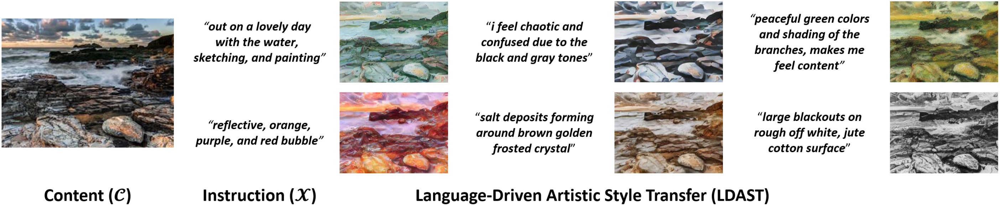
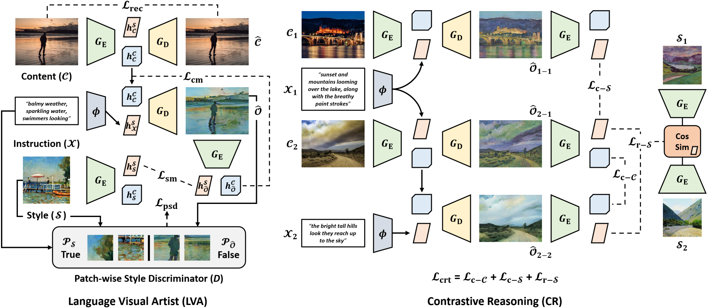

# Language-Driven Artistic Style Transfer
A **PyTorch** implementation of [LDAST](https://tsujuifu.github.io/pubs/arxiv_ldast.pdf)



## Overview
LDAST is an implementation of <br>
"[Language-Driven Artistic Style Transfer](https://tsujuifu.github.io/pubs/arxiv_ldast.pdf)" <br>
[Tsu-Jui Fu](https://tsujuifu.github.io), [Xin Eric Wang](https://eric-xw.github.io/), and [William Yang Wang](https://sites.cs.ucsb.edu/~william)



Language visual artist (LVA) extracts **content structures from <I>C</I>** and **visual patterns from <I>X</I>** to perform LDAST. LVA adopts the **patch-wise style discriminator <I>D</I>** to connect extracted visual semantics to **patches of paired style image (<I>P<sub>S</sub></I>)**. Contrastive reasoning (CR) allows comparing **contrastive pairs <I>C<sub>1</sub>-X<sub>1</sub></I>, <I>C<sub>2</sub>-X<sub>1</sub></I>, and <I>C<sub>2</sub>-X<sub>2</sub></I>** of content image and style instruction. 

## Requirements
This code is implemented under **Python 3.8**, [PyTorch 1.7](https://pypi.org/project/torch/1.7.0), and [Torchvision 0.8](https://pypi.org/project/torchvision/0.8.0). <br>
+ [tqdm](https://pypi.org/project/tqdm)
+ [CLIP](https://github.com/openai/clip)

## Usage
### Dataset
The [dataset](https://drive.google.com/drive/folders/1fznNVe7gChMBfFRK3Z9I_pkVC3vCcF19) includes content images and visual attribute instructions ([DTD](https://github.com/ChenyunWu/DescribingTextures)). <br>
Please visit [WikiArt](https://www.wikiart.org/) and [here](https://docs.google.com/forms/d/e/1FAIpQLScmq5Ob4v2VNLHqPpo7CAh81v_uRW_Kkwqmd0NTcS6nu1vMYg/viewform) for emotional effect instructions ([ArtEmis](https://www.artemisdataset.org)).

### Inference
Put [clva_dtd.pt](https://drive.google.com/drive/folders/1CPeG-V4f4J-o-s_1j0LjJlncho0QsKtq) in [./\_ckpt](https://github.com/tsujuifu/pytorch_ldast/tree/main/_ckpt).
```
python inference.py
```

## Citation
```
@inproceedings{fu2021ldast, 
  author = {Tsu-Jui Fu and Xin Eric Wang and William Yang Wang}, 
  title = {Language-Driven Artistic Style Transfer}, 
  booktitle = {arXiv:2106.00178}, 
  year = {2021} 
}
```
